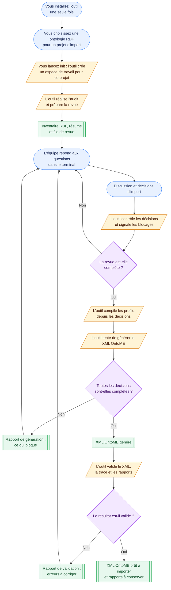

# Guide utilisateur

## À quoi sert cet outil ?

Vous avez une ontologie RDF, par exemple un fichier RDF/XML. Vous voulez créer un fichier XML que OntoME peut importer.

L'outil ne transforme pas automatiquement n'importe quelle ontologie en XML OntoME. Il fait un travail contrôlé en trois temps :

1. Il lit l'ontologie et relève tout ce qu'elle contient.
2. Il vérifie que chaque information à publier a une règle de transformation explicitement décidée.
3. Il génère et valide le XML seulement lorsque ces décisions sont complètes.

L'objectif est d'éviter un XML d'import qui invente des labels, des langues, des identifiants, des domaines, des ranges ou des références externes.

L'outil ne réalise pas un alignement sémantique entre l'ontologie source et OntoME. Il publie les classes et propriétés de la source dans le nouveau namespace OntoME décrit par le projet d'import. Lorsqu'une ressource source référence un terme d'un namespace déjà présent dans OntoME, le XML produit une référence technique vers ce namespace et cet identifiant de terme. Par exemple, une sous-classe de `.../E89_Propositional_Object` peut devenir une référence à `E89` avec l'attribut `referenceNamespace` correspondant au namespace OntoME de la version CRM concernée.

Le logiciel conserve temporairement quelques noms internes historiques contenant `mapping`. Ils ne correspondent pas à un alignement sémantique : les décisions de publication sont prises dans la revue terminale et l'outil génère ensuite ses profils techniques.

## Ce que l'outil fait et ne fait pas

L'outil sait :

- lire une source Turtle, RDF/XML ou N-Triples ;
- inventorier classes, propriétés, labels, littéraux, langues, datatypes et blank nodes ;
- signaler les constructions RDF/OWL/SKOS inconnues ou hors périmètre ;
- créer des classes et propriétés dans le namespace OntoME cible lorsque leurs règles de transformation sont explicites ;
- produire un XML déterministe, une trace de provenance et des rapports ;
- vérifier le XML contre le XSD OntoME fourni avec l'outil.

La liste précise des assertions RDF/RDFS/OWL/SKOS acceptées et de celles qui bloquent est définie dans la [Semantic Policy](semantic-policy.md). L'outil ne fait aucune inférence OWL ou RDFS.

L'outil ne sait pas :

- décider quelles ressources RDF publier, ni quelles ressources exclure ;
- deviner une règle d'identification ou inventer un label ;
- choisir à votre place une langue, un domaine ou un range ;
- convertir les restrictions OWL, cardinalités, unions, intersections, chaînes de propriétés, individus ou propriétés d'annotation ;
- inventer une interprétation métier pour une construction RDF sans décision explicite.

Autrement dit : vous fournissez l'ontologie, le périmètre de publication et les règles de transformation ; l'outil contrôle ces décisions et fabrique un XML fiable.



## Installer l'outil

Cette étape ne concerne pas encore votre ontologie. Placez-vous d'abord dans le dossier parent où vous souhaitez cloner le dépôt : `git clone` y créera le dossier `OntoME_importer`. L'installation Python reste dans son environnement virtuel `.venv`.

```bash
git clone git@github.com:lod4hss-semantics/OntoME_importer.git
cd OntoME_importer
git switch cli_importer
python -m venv .venv
source .venv/bin/activate
python -m pip install -e .
```

Sous Windows, l'activation est :

```bash
.venv\Scripts\activate
```

Vérifier ensuite :

```bash
ontome-importer --help
```

Cloner le dépôt récupère le code. La commande `python -m pip install -e .` installe les bibliothèques nécessaires et crée la commande `ontome-importer` ; l'option `[test]` est réservée aux personnes qui exécutent les tests du logiciel. L'installation ne choisit pas votre fichier RDF et ne l'envoie pas à OntoME.

## Créer l'espace de travail

L'installation de l'outil se fait une seule fois. Ensuite, `init` fait partie du début de chaque projet d'import : il crée le dossier de travail de ce projet, copie votre RDF et prépare les fichiers de décision.

Un projet d'import regroupe une source RDF, les décisions prises par l'équipe et les fichiers produits. Lancez donc `init` une fois pour chaque ontologie ou import que vous souhaitez traiter séparément. Ne relancez pas `init` pour un projet existant : l'outil refuse d'écraser son dossier de travail.

Vous pouvez lancer `init` depuis n'importe quel dossier du terminal. Les options `--source` et `--workspace` indiquent explicitement où se trouvent le RDF et le nouveau dossier à créer. Les chemins absolus, comme dans l'exemple suivant, évitent toute ambiguïté.

Avant `init`, créez dans OntoME le namespace ou la version cible. Copiez son ID ou l'URL de sa page. L'ID est une donnée d'entrée obligatoire, jamais déduit de l'ontologie source. `init` n'interroge pas OntoME pour vérifier la cible.

Exemple avec un RDF/XML :

```bash
ontome-importer init \
  --source ~/Téléchargements/mon-ontologie.rdf \
  --format rdfxml \
  --target-ontome-namespace 'https://ontome.net/namespace/123#namespace-hierarchy' \
  --workspace ~/Documents/imports/mon-ontologie
```

`--source` est votre fichier RDF original. Il n'est pas modifié. L'outil en copie les octets dans le nouveau dossier de travail et calcule son checksum.

`--workspace` est le nouveau dossier que l'outil doit créer. Il doit ne pas encore exister. L'outil refuse d'écraser un import existant.

`--target-ontome-namespace` accepte l'ID positif (`123`) ou une URL de page `https://ontome.net/namespace/123`. Si l'option manque, le terminal demande cette valeur ; en mode non interactif, elle est obligatoire. L'ID est enregistré tel quel : assurez-vous qu'il désigne la bonne cible dans votre instance OntoME, notamment si vous travaillez en staging. Aucun appel API ne vérifie cette cible.

L'URI RDF, le libellé et sa langue proviennent de la déclaration `owl:Ontology` dans la source lorsque celle-ci est non ambiguë. Si l'URI manque ou est ambiguë, précisez `--target-namespace-uri`. Si cette URI n'a pas de libellé, l'outil reprend le seul libellé d'ontologie disponible dans la source ; s'il manque ou est ambigu, précisez `--target-label` et `--target-label-lang`. `owl:versionInfo` (ou à défaut `owl:versionIRI`) fournit la version si elle est unique ; `--target-version` permet de la préciser.

Par défaut, `--scope-uri-prefix` reprend l'URI RDF cible. **L'URI de l'ontologie et le préfixe de ses termes peuvent être différents** : dans ce cas, indiquez les deux séparément. Si plusieurs préfixes doivent être importés, répétez l'option :

```bash
ontome-importer init \
  --source ~/Téléchargements/mon-ontologie.rdf \
  --format rdfxml \
  --target-ontome-namespace 123 \
  --target-namespace-uri 'https://example.org/ontology/' \
  --scope-uri-prefix 'https://example.org/terms/' \
  --scope-uri-prefix 'https://example.org/extension/' \
  --workspace ~/Documents/imports/mon-ontologie
```

Remplacez les URI d'exemple par celles déclarées dans votre fichier. Si la source déclare plusieurs `owl:Ontology`, `--target-namespace-uri` évite de choisir la mauvaise URI. Le préfixe du périmètre doit couvrir les classes et propriétés que vous voulez examiner, sans inclure par accident tout le Web RDF.

Si le fichier s'appelle `.ttl`, `.nt`, `.rdf`, `.xml` ou `.owl`, le format est déduit automatiquement. Indiquer `--format` reste recommandé lorsqu'il y a un doute.

La commande affiche ensuite la prochaine commande à lancer.

Après `init`, placez-vous dans le workspace créé. C'est à partir de là que les chemins courts `config/...` et `build/...` utilisés par `audit`, `generate` et `validate` sont corrects :

```text
Installer l'outil une fois
        ↓
Lancer init une fois pour un projet d'import
        ↓
Se placer dans le workspace créé
        ↓
Auditer, décider, générer et valider autant de fois que nécessaire
```

Si vous souhaitez importer une autre ontologie, ou conserver un import indépendant pour une nouvelle version de la source, créez un nouveau workspace avec `init` et un autre chemin `--workspace`.

### Ce que `init` crée

```text
mon-ontologie/
  README.md
  source/
    ontology.<extension-rdf>
  config/
    audit.yaml
    generation.yaml
    profiles/
      capability-audit.yaml
      capability-generation.yaml
      namespace-registry.yaml
      mapping-audit.yaml
      mapping-generation.yaml
  build/
```

Le fichier `README.md` de ce dossier répète les prochaines commandes avec les chemins déjà corrects.

| Élément créé | Rôle |
| --- | --- |
| `source/ontology.<extension-rdf>` | Copie de votre ontologie ; l'extension d'origine est conservée et c'est le RDF utilisé par l'import. |
| `config/audit.yaml` | Fichier de départ pour la première analyse. |
| `config/generation.yaml` | ID et URI déclarés de la cible OntoME et chemins des profils de génération. |
| `capability-*.yaml` | Paramètres techniques fournis par l'outil pour le XSD OntoME. Vous ne les modifiez normalement pas au début. |
| `namespace-registry.yaml` | Registre technique généré par la revue pour les références externes réellement conservées. |
| `mapping-audit.yaml` | Définit le périmètre du premier audit. |
| `mapping-generation.yaml` | Fichier compilé où l'équipe publie les décisions d'import après l'audit. |

Le XSD OntoME est livré avec l'outil. Vous n'avez pas à chercher ou copier un fichier XSD.

### Les décisions d'import, après l'audit

La revue terminale demande des décisions distinctes : **quelles classes/propriétés créer**, **quelles assertions conserver, transformer ou ignorer**, **quelles références externes conserver**, puis **comment traiter les champs indispensables manquants**. Publier une ressource n'autorise pas à ignorer ses assertions. Vous n'avez pas à modifier les profils YAML : `review finalize` les génère à partir des décisions enregistrées.

Vous ne devez pas prendre ces décisions avant le premier audit. Le rapport donne la liste exacte des éléments sur lesquels l'équipe doit se prononcer. Il ne demande pas de décider d'un alignement sémantique avec OntoME : les ressources sélectionnées sont publiées dans le namespace cible.

## Les commandes, dans l'ordre

Ouvrir un terminal dans votre dossier de travail, pas nécessairement dans le dépôt :

```bash
cd ~/Documents/imports/mon-ontologie
```

### 1. Auditer

```bash
ontome-importer audit \
  --manifest config/audit.yaml \
  --output-dir build/audit
```

Cette commande utilise exactement le manifest indiqué après `--manifest`. Elle produit :

- `build/audit/inventory.json` : tout ce qui a été lu dans le RDF ;
- `build/audit/audit.json` : le rapport complet détaillé ;
- `build/audit/audit.md` : le résumé à lire en priorité, notamment les ressources candidates, les données manquantes et les références potentielles ;
- `build/audit/review-queue.json` : la file de revue utilisée par le terminal.

L'audit peut se terminer avec le code `0` tout en signalant des blocages. C'est normal : il a terminé son analyse, pas l'import. Ses constats (*findings*) sont des diagnostics liés aux assertions RDF ; **un constat n'est pas une décision**. Les observations hors périmètre ne sont pas candidates à l'import. Lancez ensuite la revue terminale.

### 2. Revoir les ressources et les assertions

La revue est locale et guidée. Elle enregistre les choix et leur journal dans `decisions/review.json`. Commencez ou reprenez la session :

```bash
ontome-importer review start \
  --manifest config/generation.yaml \
  --session decisions/review.json
```

Par défaut, une information RDF non représentable **reste en attente d'une décision** : `publier` une classe ou propriété ne signifie pas `ignorer` ses assertions. Pour interdire toute omission concernant les ressources publiées, ajoutez `--assertion-policy strict` à la commande `review start` ci-dessus. Reprendre une session conserve les décisions enregistrées pour la même source.

Choisissez ensuite les classes et propriétés à créer :

```bash
ontome-importer review resources --session decisions/review.json
```

La commande enchaîne les ressources en attente. Répondez `p` (publier), `e` (exclure, avec un motif) ou `s` (laisser en attente). Une propriété d'annotation que le XML ne sait pas créer ne peut pas être marquée `p`. Pour une séance courte, ajoutez `--limit 10`. Pour modifier une décision déjà prise, utilisez `--resource 'URI-de-la-ressource'`.

Si vous avez défini un **sous-ensemble à exclure**, une décision par lot est possible. La commande affiche le nombre concerné et applique aussitôt la décision ; utilisez `--limit` pour en maîtriser la taille :

```bash
ontome-importer review resources \
  --session decisions/review.json \
  --action exclude \
  --reason 'Hors du périmètre approuvé pour cet import' \
  --limit 10
```

`--action publish` existe aussi pour des lots de ressources publiables, mais ce choix ne règle ni leurs assertions ni leurs champs obligatoires. Les décisions se révisent avec `--resource`.

Pour les assertions encore en attente, passez à :

```bash
ontome-importer review assertions --session decisions/review.json
```

La CLI regroupe les cas récurrents, indique le nombre d'assertions concernées et montre un exemple. Selon le cas, elle propose : **conserver** dans un champ XML pris en charge (`k`), **transformer** un littéral en note (`t`), **ignorer** explicitement (`i`, avec motif) ou **laisser en attente** (`s`). Une décision de groupe ne s'applique qu'aux assertions de cette source couvertes par la session. L'audit et le rapport de génération conservent les triplets, le motif et l'auteur des omissions. Pour réexaminer un cas isolé déjà décidé, `--finding ID` est disponible ; l'ID figure dans `build/audit/audit.json`.

### 3. Revoir les références externes et les champs obligatoires

```bash
ontome-importer review references --session decisions/review.json
ontome-importer review required --session decisions/review.json
```

`review references` ne demande un catalogue **que pour les relations retenues dans le XML** qui pointent hors des ressources publiées. Il propose d'ignorer la relation avec un motif (`i`), de fournir un export RDF/XML OntoME local (`l`) ou de télécharger un export (`f`). Dans les deux derniers cas, le terminal demande l'URI exacte du namespace externe, son ID OntoME et sa version éventuelle ; le terme référencé doit apparaître **avec sa propre URI exacte et un identifiant `skos:notation`** dans ce catalogue. Aucun identifiant n'est déduit de son suffixe. Si l'export provient d'une autre instance OntoME, passez son URL de base lors de cette étape :

```bash
ontome-importer review references \
  --session decisions/review.json \
  --ontome-base-url 'https://votre-instance-staging.example.org'
```

Remplacez cette URL d'exemple par celle de votre instance. Cela ne provoque toujours aucun appel API vers le namespace cible de l'import. Pour revenir sur une référence déjà décidée, ajoutez `--uri 'URI-du-terme-externe'` à `review references`.

`review required` permet de confirmer **avec un motif** la langue d'un libellé sans langue ; cette transformation est tracée. Si une propriété n'a aucun domaine ou aucune portée dans la source, vous pouvez choisir une classe publiée dans le même import comme référence éditoriale justifiée, exclure la propriété ou laisser ce point en attente. Il n'est pas possible de remplacer ainsi un domaine ou une portée **déjà présents** dans le RDF mais impossibles à résoudre : il faut traiter leur référence ou revoir la publication de la propriété. Le XSD exige ces champs ; la CLI n'invente aucune valeur. Si une ressource n'a aucun libellé exploitable, `review check` la signalera et vous pourrez réviser son choix de publication.

### 4. Prévalider et finaliser

```bash
ontome-importer review check --session decisions/review.json
```

Cette commande fait **la même résolution et la même vérification XSD que la génération**, sans écrire le XML : elle indique soit que le dossier est prêt, soit quelles décisions et données bloquent encore. Si elle est bloquée, reprenez l'étape concernée avec `review resources`, `review assertions`, `review references` ou `review required`, puis relancez `review check`. Un code `0` indique que vous pouvez finaliser :

```bash
ontome-importer review finalize \
  --manifest config/generation.yaml \
  --session decisions/review.json
```

`finalize` refait le précontrôle avant d'écrire les profils techniques dans `config/profiles/`. Les décisions métier restent dans la session ; il n'est pas nécessaire d'éditer les fichiers YAML. Le choix de la cible OntoME reste déclaratif. Une construction OWL que le XML ne sait pas représenter peut être omise après décision explicite, mais cela ne rend pas les deux ontologies sémantiquement équivalentes.

### 5. Générer

Lorsque le profil de transformation de génération est complet :

```bash
ontome-importer generate \
  --manifest config/generation.yaml \
  --output-dir build/import
```

Cette commande relit la source, refait l'audit, applique les règles de transformation, écrit le XML et le valide contre le XSD OntoME.

En succès, elle écrit :

- `build/import/import.xml` ;
- `build/import/generation-trace.json` ;
- `build/import/generation-audit.json`.

En cas de blocage, elle écrit seulement `generation-audit.json`. Elle n'écrit jamais de XML final incomplet. Après une correction, relancez `review check`, `review finalize` et `generate` : les anciens artefacts générés sont archivés dans `build/import/.history/` avant remplacement.

### 6. Valider le résultat

```bash
ontome-importer validate \
  --manifest config/generation.yaml \
  --xml build/import/import.xml \
  --trace build/import/generation-trace.json \
  --audit build/import/generation-audit.json \
  --output build/import/validation.json
```

Cette commande vérifie le XML, le XSD, les identifiants, les références, les checksums, la trace et la cohérence avec votre RDF et vos profils.

Le XML et ses rapports sont prêts à transmettre seulement lorsque `build/import/validation.json` contient :

```json
"valid": true
```

## Comprendre les retours

| Code | Signification | Action |
| --- | --- | --- |
| `0` | La commande a réussi. | Passer à l'étape suivante ou archiver le résultat et ses rapports. |
| `2` | Un fichier requis, la source, le profil, le XSD ou la destination ne peut pas être utilisé. | Corriger le chemin ou le fichier signalé dans le terminal. |
| `3` | Une règle de transformation, une décision ou une validation bloque le résultat. | Lire `audit.md`, `generation-audit.json` ou `validation.json`. |

## Ce qu'il faut conserver

Pour qu'un import soit rejouable, conserver ensemble :

- la source RDF ;
- les deux manifests ;
- les cinq profils ;
- `decisions/review.json`, son journal et les catalogues OntoME téléchargés ;
- les profils internes compilés par `review finalize` ;
- le XML généré ;
- la trace de génération ;
- les audits ;
- le rapport de validation ;
- l'identité du XSD utilisé.

## Aller plus loin

- [Configuration Guide](configuration.md) : syntaxe YAML complète.
- [RDF Inventory](phase-2-rdf-inventory.md) : formats RDF supportés et inventaire.
- Les documents phase 3, 4 et 5 expliquent les détails techniques du moteur ; ils ne sont pas nécessaires pour suivre les commandes de ce guide.
